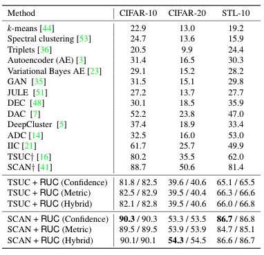
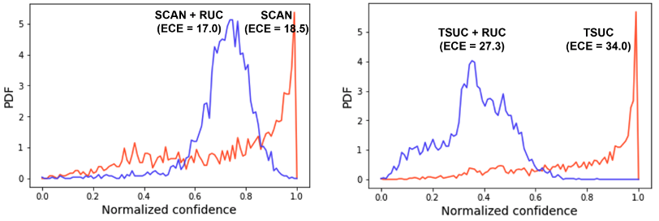
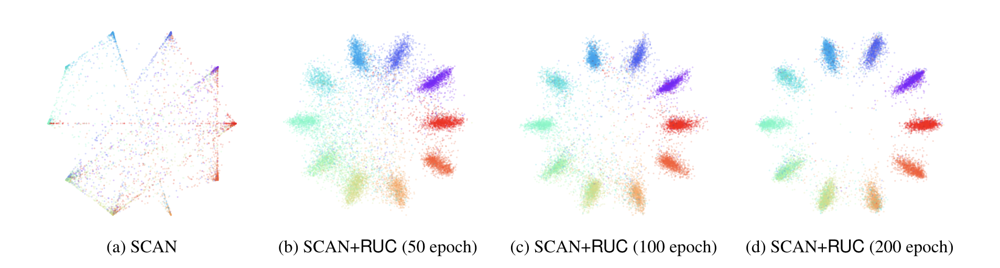
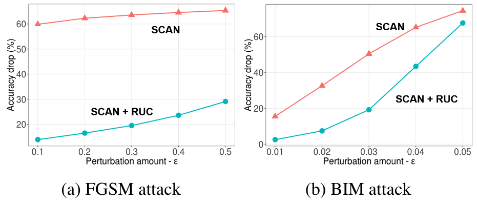
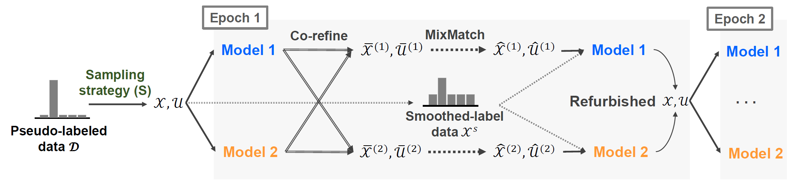

# Improving Unsupervised Image Clustering With Robust Learning #
This repo is the PyTorch codes for "Improving Unsupervised Image Clustering With Robust Learning (RUC)"
> [**Improving Unsupervised Image Clustering With Robust Learning**](https://arxiv.org/abs/2012.11150)
> >
> Sungwon Park, Sungwon Han, Sundong Kim, Danu Kim, Sungkyu Park, Seunghoon Hong, Meeyoung Cha.
## Highlight ##

-  **Accepted at CVPR 2021.**
- 🏆 __SOTA on 4 benchmarks. Check out [Papers With Code](https://paperswithcode.com/paper/learning-to-classify-images-without-labels) for [Image Clustering](https://paperswithcode.com/task/image-clustering) or [Unsup. Classification](https://paperswithcode.com/task/unsupervised-image-classification).__
1. RUC is an add-on module to enhance the performance of any off-the-shelf unsupervised learning algorithms. RUC is inspired by robust learning. It first divides clustered data points into clean and noisy set, then refine the clustering results. With RUC, state-of-the-art unsupervised clustering methods; SCAN and TSUC showed showed huge performance improvements. (STL-10 : 86.7%, CIFAR-10 : 90.3%, CIFAR-20 : 54.3%)

<p align="center">
   </center>
</p>

2. Prediction results of existing unsupervised learning algorithms were overconfident.  RUC can make the prediction of existing algorithms softer with better calibration.
<p align="center">
   </center>
</p>
<p align="center">
   </center> 
</p>

3. Robust to adversarially crafted samples. ERM-based unsupervised clustering algorithms can be prone to adversarial attack. Adding RUC to the clustering models improves robustness against adversarial noise.

<p align="center">
   </center> 
</p>


## Required packages ##
- python == 3.6.10
- pytorch == 1.1.0
- scikit-learn == 0.21.2
- scipy == 1.3.0
- numpy == 1.18.5
- pillow == 7.1.2

## Overall model architecture ##
<center> </center>

## Usage ##
```
usage: main_ruc_[dataset].py [-h] [--lr LR] [--momentum M] [--weight_decay W]
                         [--epochs EPOCHS] [--batch_size B] [--s_thr S_THR]
                         [--n_num N_NUM] [--o_model O_MODEL]
                         [--e_model E_MODEL] [--seed SEED]

config for RUC

optional arguments:
  -h, --help            show this help message and exit
  --lr LR               initial learning rate
  --momentum M          momentum
  --weight_decay        weight decay
  --epochs EPOCHS       max epoch per round. (default: 200)
  --batch_size B        training batch size
  --s_thr S_THR         confidence sampling threshold
  --n_num N_NUM         the number of neighbor for metric sampling
  --o_model O_MODEL     original model path
  --e_model E_MODEL     embedding model path
  --seed SEED           random seed
```

## Model ZOO ##
Currently, we support the pretrained model for our model. We used the pretrained SCAN and SimCLR model from SCAN github.
(o_model : SCAN , e_model : SimCLR)
### SCAN ###
| Dataset           | o_model | e_model |
|-------------------|---------------|---------------| 
|CIFAR-10           | [Download](https://drive.google.com/file/d/1ONJbw6Qnccgl20uN38pS3RgpqeobAWxb/view?usp=sharing)  | [Download](https://drive.google.com/file/d/1uczIKDCQRZiysgGmyaro0Ukk8VIDQlu3/view?usp=sharing)  |
|CIFAR-20           | [Download](https://drive.google.com/file/d/1SWXqE5Esu4j4n7QUrL6kbR39Xzb6bgJg/view?usp=sharing)  | [Download](https://drive.google.com/file/d/1JzzMjqvd3zPNDh0ndWWfgJrxAEg3jTKw/view?usp=sharing)  |
|STL-10             | [Download](https://drive.google.com/file/d/15lFVyOjZvGbqdZ1R150XL9-SuGgo57kp/view?usp=sharing)  | [Download](https://drive.google.com/file/d/148D5ys5KA4Xm2sSBDqNmCUxiCgzf0cP6/view?usp=sharing)  |

### Ours ###
| Dataset           | Download link |
|-------------------|---------------| 
|CIFAR-10           | [Download](https://drive.google.com/file/d/16Wcby-8etsTPPIlsQb9oluk3NN8kSmCX/view?usp=sharing)  |
|CIFAR-20           | [Download](https://drive.google.com/file/d/118SIQ3YBx1y9Uoq-Wo3FyW9iYELKjcQJ/view?usp=sharing)  |
|STL-10             | [Download](https://drive.google.com/file/d/1mHLkC2JrKsnMswIeT6wKO4fV97DbTHtJ/view?usp=sharing)  |

## Citation

If you find this repo useful for your research, please consider citing our paper:

```
@article{park2020improving,
  title={Improving Unsupervised Image Clustering With Robust Learning},
  author={Park, Sungwon and Han, Sungwon and Kim, Sundong and Kim, Danu and Park, Sungkyu and Hong, Seunghoon and Cha, Meeyoung},
  journal={arXiv preprint arXiv:2012.11150},
  year={2020}
}
```
